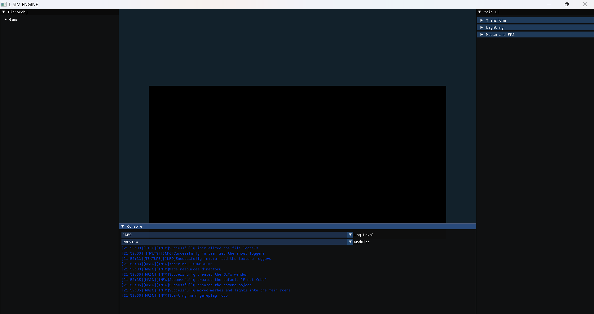
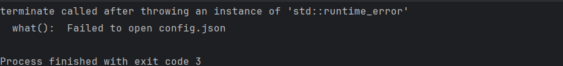

## Fixing Launcher Issues
When you load a project there is a non-zero chance that something could go wrong.
Whether it is your fault or ours, issues can and most likely will eventually occur.
Here I will cover 2 of the most common errors that occur whilst launching the [L-SIM Engine](https://github.com/Haletas033/LSIMLAUNCHER).
### 1. Shader Misconfiguration
Upon loading into the project, one of the most common errors you may see is an unmoving black rectangle where the cube should be.
This is caused by a shader misconfiguration where the shaders fail to load.
Luckily, fixing this issue is simple.
All you have to do is:
* Ensure that all three shaders exist these being: `default.vert`, `default.frag`, and `default.geom`
* Make sure they are error free and include **all** fields

After checking these the issue should go away.

**PHOTO SHOWCASING MENTIONED ISSUE**

### 2. Config Misconfiguration
This issue is very similar in nature but instead of being an issue with shaders is an issue with the config.
Unlike a shader misconfiguration, a config misconfiguration will crash. 
### So how do I know if it's a config issue?
Telling if the crash was caused by a config misconfiguration is actually quite straightforward.
This is because there will be a distinct error message (shown in the photo further down). 
To fix this issue simply ensure that all required fields exist inside your `config.json`.

**PHOTO SHOWCASING MENTIONED ERROR MESSAGE**

---

### What to do if the issue is not caused by me?
If the issue isn't caused by you and was not caused due to requirements not being met by your device. Remember this is a **Windows-only** project as of writing this.
The best course of action is to create an issue on the [L-SIM Engine](https://github.com/Haletas033/LSIMENGINE) repo **especially if the issue is one of the two mentioned above.**

**EDITORS NOTE:** _While there is technically the chance of getting an error because of an issue with the `resources` directory it is far less common, as in order for resources to work there just has to be a `resources` directory in the project.
Even though it is still worth checking if you are having an error when loading textures._ 