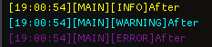
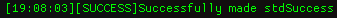

## Working With Configs
After mastering the basics the next thing you should learn is how configs work.
In L-SIM every project has its own config file.
We use config or more generally `.json` files to avoid the need to rebuild the project every time we adjust a value.
A config in L-SIM is a single `.json` file (**as of v1.0**) that contains information regarding engine defaults.
Here we will take a look at a `config.json` and how we can modify it to meet our needs.

**Below is the default config file that we will be working from**

<details>
    <summary role="button" class="outline secondary"><strong>Click to see the full defaults config</strong></summary>
<article>

````json
{
    "shader-constants": {
      "MAX_LIGHTS": 8
    },
        "defaults": {
            "version": "v1.0",
            "defaultWindowWidth": 1920,
            "defaultWindowHeight": 1080,
        
            "size": 256,
            "gridScale": 2.0,
            "heightScale": 80.0,
            "scale": 15.0,
            "octaves": 8,
            "persistence":0.5,
            "lacunarity": 2.0,
        
            "sphereStacks": 20,
            "sphereSlices": 20,
        
            "torusRingSegments": 40,
            "torusTubeSegments": 20,
            "torusRingRadius": 1.0,
            "torusTubeRadius": 0.3,
        
            "FOVdeg": 45.0,
            "nearPlane": 0.1,
            "farPlane": 10000.0,
            "sensitivity": 100.0,
            "speed": 1.0,
            "speedMultiplier": 50.0,
        
            "transformSpeed": 0.1
        },
        "loggers": {
            "stdInfo": {
                "hasTimeStamp": true,
                "colour": "INFO_COLOUR",
                "type": "INFO",
                "level": 0
            },
            "stdWarn": {
                "hasTimeStamp": true,
                "colour": "WARNING_COLOUR",
                "type": "WARNING",
                "level": 1
            },
            "stdError": {
                "hasTimeStamp": true,
                "colour": "ERROR_COLOUR",
                "type": "ERROR",
                "level": 2
            }
        }
}
````

</article>
</details>

Now if you have worked with before this should be about all you need to get started.
However, if you have not used or even seen a `.json` file before don't worry, by the end of this page you should have a good enough understanding to work with config files in L-SIM and even use them in other applications.
Every `.json` file begins with `{` and ends with `}`. Between these 2 braces are a set of key-value pairs and arrays.
Working from the top down the L-SIM `config.json` file has 3 keys in the first layer.

**Let's take a look at these.**
```json
{
  "shader-constants": {},
  "defaults" : {},
  "loggers" :  {}
}
```
In L-SIM the 3 keys in the first layer are `shader-constants`, `defaults`, and `loggers`.

Let's start by taking a look at `shader-constants` as it is the simplest.
```json
{
  "shader-constants": {
    "MAX_LIGHTS": 8
  }
}
```
The `shader-constants` key contains one other key `MAX_LIGHTS` with a value of 8.
If you had tried to create more than 8 lights, you would have noticed that the engine wouldn't let you.
This is because of the `MAX_LIGHTS` key being set to 8.
If you want you can now try to change it to a different value such as 16 or 4.
Keep in mind that the larger this value the slower the engine will run, although this shouldn't be noticeable so long as the number is not insanely high.

If you want you can also try adding another key-value pair. In this example we will add a `DEFAULT_COLOUR`.
```json
{
  "shader-constants": {
    "MAX_LIGHTS": 8,
    "DEFAULT_RED": 1,
    "DEFAULT_GREEN": 0,
    "DEFAULT_BLUE": 0
  }
}
```
**As of v1.0** we have to add every value separately, but hopefully in newer versions syntax like `DEFAULT_COLOUR: "vec4(1, 0, 0, 1)"` will be supported.
How that we have our new fields we need to  use them in our `default.frag` in the `shaders` directory.
`default.frag` is the fragment shader which handles the colour of every pixel (fragment) on the screen.
Which is why we want to use it here.

Upon opening `default.frag` find this line
```c
vec4 baseColor = useTexture ? texture(tex0, texCoord) : meshColor;
```
Now it won't go too into depth about what is happening here. Just know that we are checking to see if we should use a texture or a flat colour.
So in order to use our default colour we should replace the `meshColour` part with `vec4(DEFAULT_RED, DEFAULT_GREEN, DEFAULT_BLUE, 1.0f)`
How upon loading into the game the default cube and any other mesh without a texture should be your colour (in this case red).

#### So how does this work?
If you have written a shader before you may have noticed the that version part is missing.
Do **not** add it. This is because when the program loads the shaders it first appends the version then for every shader constant you have it does.

```c
#define [key] [value]
```

in our case we get

```c
#version 330 core
#define MAX_LIGHTS 8
#define DEFAULT_RED 1
#define DEFAULT_GREEN 0
#define DEFAULT_BLUE 0
```
at the top of every shader. We can also use these in engine itself, but we will come back to that later.

Now that you have an understanding of the `shader-constants` section lets move onto the next section `defaults`.

<details>
    <summary role="button" class="outline secondary"><strong>Click to see the full defaults config</strong></summary>
<article>

```json
{
    "defaults": {
        "version": "v1.0",
        "defaultWindowWidth": 1920,
        "defaultWindowHeight": 1080,
    
        "size": 256,
        "gridScale": 2.0,
        "heightScale": 80.0,
        "scale": 15.0,
        "octaves": 8,
        "persistence":0.5,
        "lacunarity": 2.0,
    
        "sphereStacks": 20,
        "sphereSlices": 20,
    
        "torusRingSegments": 40,
        "torusTubeSegments": 20,
        "torusRingRadius": 1.0,
        "torusTubeRadius": 0.3,
    
        "FOVdeg": 45.0,
        "nearPlane": 0.1,
        "farPlane": 10000.0,
        "sensitivity": 100.0,
        "speed": 1.0,
        "speedMultiplier": 50.0,
    
        "transformSpeed": 0.1
    }
}
```
</article>
</details>

If you knew nothing about json before this part should be somewhat clear to you now.
The `defaults` section stores all the information used by the engine at runtime.

Most of these won't be of much interest to you but some you might want to change are `speedMultiplier`, `transformSpeed`, `sensitivity`, and some of the terrain ones can be fun to play around with.
Over all the `defaults` section is pretty simple, but **as of v1.0** you must ensure all of these fields exist, but nothing stops you from adding more which is what we will look at right now **(:**

#### Making our own
To make your own new defaults we should first draw our attention to `include/defaults.h`.
<details>
    <summary role="button" class="outline secondary"><strong>Click to see the full defaults file</strong></summary>
<article>

```c
//
// Created by halet on 9/5/2025.
//

#ifndef DEFAULTS_H
#define DEFAULTS_H

struct Defaults {
    unsigned int MAX_LIGHTS = 8;
    std::string version = "v1.0";
    unsigned int defaultWindowWidth = 1920;
    unsigned int defaultWindowHeight = 1080;

    //Terrain defaults
    unsigned int size = 256;
    float gridScale = 2.0f;
    float heightScale = 80.0f;
    float scale = 15.0f;
    int octaves = 8;
    float persistence = 0.5f;
    float lacunarity = 2.0f;

    //Sphere defaults
    int sphereSlices = 20;
    int sphereStacks = 20;

    //Torus defaults
    int torusRingSegments = 40;
    int torusTubeSegments = 20;
    float torusRingRadius = 1.0f;
    float torusTubeRadius = 0.3f;

    //Camera defaults
    float FOVdeg = 45.0f;
    float nearPlane = 0.1f;
    float farPlane = 10000.0f;
    float sensitivity = 100.0f;
    float speedMultiplier = 50.0f;

    //Input defaults
    float transformSpeed = 0.1f;
};

#endif //DEFAULTS_H
```

</article>
</details>
You should be able to immediately see that it is almost the same as the `defaults` section in `config.json`.

In this example we will add a new default for the caption at the top of the window.
To do this we can first add it to `defaults.h` in this case we can do:

```c
std::string caption = "L-SIM ENGINE";
```

Now we can go into `config.json` and add:
```json
{
    "caption": "THE BEST ENGINE EVER"
}
```
then we need to go into `json.cpp` and add:
```c
configDefaults.caption = config["defaults"]["caption"].get<std::string>();
```
Finally, we can actually use this value by going into `main.cpp` and adding:
```c
//Create a GLFW window
GLFWwindow* window = glfwCreateWindow(engineDefaults.defaultWindowWidth, engineDefaults.defaultWindowHeight, (engineDefaults.caption + " " + engineDefaults.version + " " + workingDir).c_str(), nullptr, nullptr);
```
replacing "L-SIM ENGINE" with `engineDefaults.caption`.

Now we will look at the final part which is `loggers`.

<details open>
    <summary role="button" class="outline secondary"><strong>Here it is</strong></summary>
<article>

```json
{
  "loggers": {
    "stdInfo": {
      "hasTimeStamp": true,
      "colour": "INFO_COLOUR",
      "type": "INFO",
      "level": 0
    },
    "stdWarn": {
      "hasTimeStamp": true,
      "colour": "WARNING_COLOUR",
      "type": "WARNING",
      "level": 1
    },
    "stdError": {
      "hasTimeStamp": true,
      "colour": "ERROR_COLOUR",
      "type": "ERROR",
      "level": 2
    }
  }
}
```
</article>
</details>

At the moment we have 3 loggers `stdInfo`, `stdWarn`, and `stdError`. While we can't change these names we can change some of the values.

First lets change the colours. To do this we simply replace `colour` field with how desired colour (colours will be covered in more details in the logger section).
Here we will change `stdInfo` from `INFO_COLOUR` to `BRIGHT_YELLOW`, `stdWarn` to `BRIGHT_CYAN` and `stdError` to `MAGENTA`.

**This is what that will look like**

**BEFORE:**


**AFTER**



Pretty cool right.

We can also make a new logger. In this example we will make `stdSuccess` which we will use for when things in the engine succeed.

**Here's what this could look like:**

```json
{
  "stdSuccess": {
    "hasTimeStamp": true,
    "colour": "BRIGHT_GREEN",
    "type": "SUCCESS",
    "level": 2
  }
}
```
Then to use this in our project we can do:

```c
Log("stdSuccess", "Successfully made stdSuccess");
```

**Which will look like this:**



**EDITOR'S NOTE:**
_To understand what fields loggers have and what they can do refer to the loggers section._