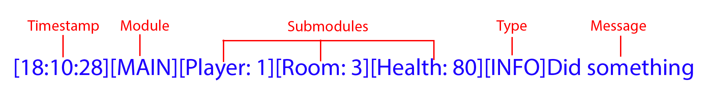

## Log System
One of the systems you will or at least should be using a lot in your projects in the logging system.
In this part we will discuss:
* Components a logger can have
* How the logging system works
* How to use loggers.

### Components of a logger
In L-SIM a log has 6 possible fields. In L-SIM you can pick and choose what fields you want, as logs are only required to have a message.

**Below is the full list of fields in order from left to right:**
1. Colour
2. Timestamp (HH:MM:SS by default)
3. Module (A log can only have one module)
4. Submodules (A log can have any number of submodules)
5. Type (e.g., INFO, WARNING, ERROR)
6. Message (required)

**Here is an example of a log using every field:**


Now let's go over each component in more detail.

#### Colour:
The L-SIM Engine uses the [ANSI colour standard](https://i.sstatic.net/9UVnC.png). This allows us to have coloured terminal outputs.
Inside the engine however these are converted back into its rgb value to be used with [ImGui](https://github.com/ocornut/imgui).
<details open>
    <summary role="button" class="outline secondary"><strong>Here is a list of every colour predefined by L-SIM:</strong></summary>
<article>

```c
#define BLACK "30m"
#define RED "31m"
#define GREEN "32m"
#define YELLOW "33m"
#define BLUE "34m"
#define MAGENTA "35m"
#define CYAN "36m"
#define WHITE "37m"

#define BRIGHT_BLACK "90m"
#define BRIGHT_RED "91m"
#define BRIGHT_GREEN "92m"
#define BRIGHT_YELLOW "93m"
#define BRIGHT_BLUE "94m"
#define BRIGHT_MAGENTA "95m"
#define BRIGHT_CYAN "96m"
#define BRIGHT_WHITE "97m"

#define ERROR_COLOUR "31m"
#define WARNING_COLOUR "33m"
#define INFO_COLOUR "34m"
```
</article>
</details>

**EDITOR'S NOTE:**
_For colours to work in [CLion](https://www.jetbrains.com/clion) make sure that "Emulate Terminal" is enabled_

#### Timestamp:
Timestamps show the time that the log was created.
By default, this displays (Hour):(Minute):(Second). 
However, if you want to use a different timestamp, you can by using the SetCustomtimestamp function, but there will be more information about that in the "How to use loggers" section.

#### Module:
The module of a log is the main category of event that the log is from.
It is recommended that the module of a log should be constant and denote the system that the log was called from. For example, [LOG], [MAIN], [GUI], [INPUTS], [MESH].

#### Submodules:
The submodules of a log are an array of subcategories that the is from.
It is recommended that the submodules of a log should be used for dynamic values that can change throughout runtime or smaller sections of a module.
For example. [COLLISION DETECTION], [PLAYER: 1][ROOM: 3][HEALTH: 80], [SERVER: AU][PING: 68ms]

#### Type:
The type of a log is the overall theme of that log.
Examples of types could be: [INFO], [WARNING], [ERROR], [SUCCESS], [UNEXPECTED]

#### Message:
The message of a log is the mian reason for the log.
Example of messages could be: [Successfully initialize client], [Player died], [QUITTING]

### How loggers work and how to use them
I won't go too much into detail on how the logging system works.
Just know that it uses a builder pattern.

Now to use a logger you can first create one in the `config.json`.
Then to use the logger in your file first add:
```c
#include <include/utils/logging/log.h>
```
at the top of the file. Then add:
```c
extern json config;

extern std::vector<Logger> logs;

static std::unordered_map<std::string, std::unique_ptr<Logger>> loggers;

static void Log(const std::string& key, const std::string& msg) {
    if (const auto it = loggers.find(key); it != loggers.end())
        (*it->second)(msg, logs);
}
```
This will get the logs for main. Technically you could also make the config yourself, but I would recommend doing it this way.
This also adds a function at the top. While not strictly necessary this function makes using loggers cleaner.

Now I recommend adding an init function to your file you configure the module for your loggers.

**Here is an example of an init function: this one is from the inputs class:**
```c
void Inputs::InitInputs() {
    JSONManager::LoadLoggers(config, loggers);

    // Ensure logger exists
    if (!loggers.count("stdInfo"))
        loggers["stdInfo"] = std::make_unique<Logger>();

    loggers["stdInfo"]->SetModule("INPUTS");
    loggers["stdWarn"]->SetModule("INPUTS");
    loggers["stdError"]->SetModule("INPUTS");

    Log("stdInfo", "Successfully initialized the input loggers");
}
```
How to log something you can do:
```c
Log([your logger e.g., "stdInfo"], [your message])
```
And to add a new part to a logger you can do:
```c
loggers[your logger]->[function to add field]([THING TO ADD]);
```
**Here is the list of functions used to add components:**\
`SetCustomTimeStamp(TimeFunc func) `TimeFunc is any function returning std::string\
`HasTimeStamp()` sets has time stamp component to true\
`SetColour(const std::string &c)`\
`SetType(const std::string &t)`\
`SetModule(const std::string &m`\
`AddSubModules(const std::initializer_list<std::string>& sms)` used like `loggers[stdInfo]->AddSubModules({foo, bar})`
